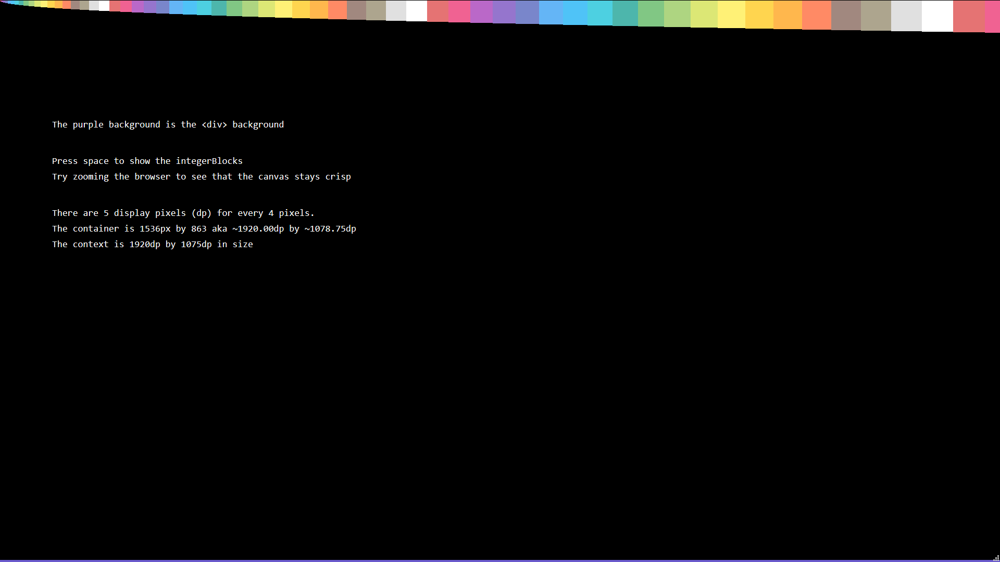

# based-canvas

A canvas to base things off of.

[Try the example: ](https://coalpha.github.io/based-canvas/example/)

Ok yeah it's a crap name but I keep hearing the word.

There's a cursed bug where the loading order of the page matters.
Basically if the `ResizeObserver` isn't registered to canvasContainer
before it's painted, some state isn't going to be updated and you're
gonna have a bad time.
